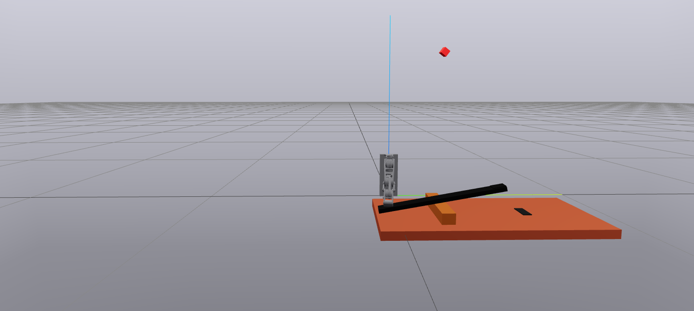
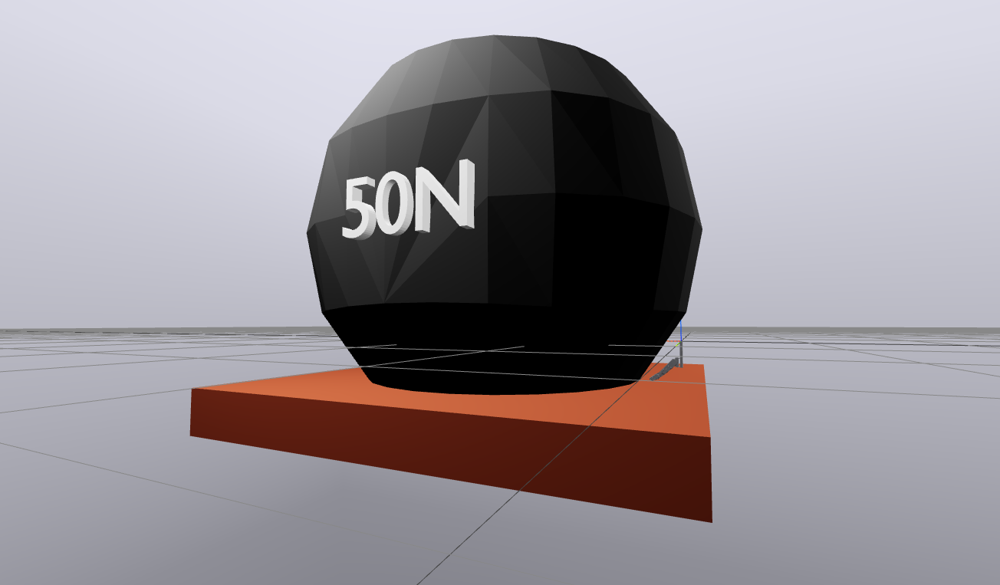
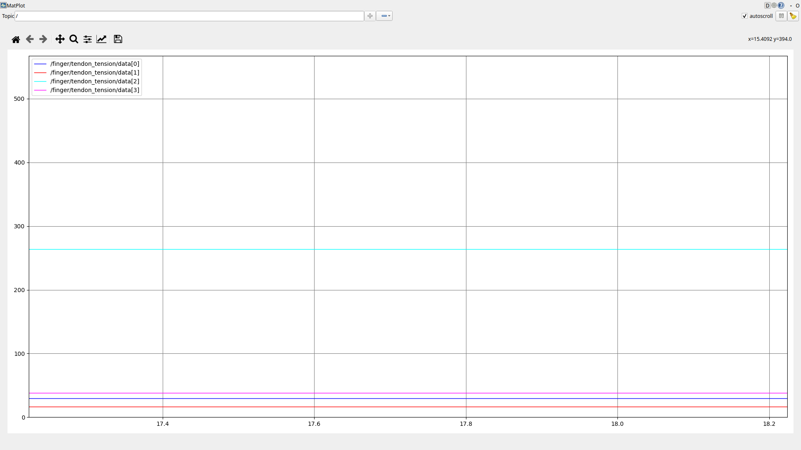
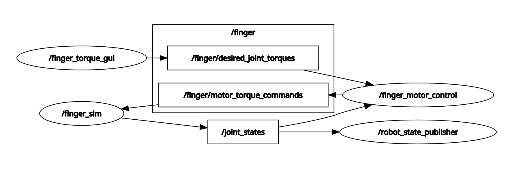
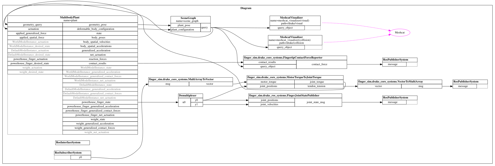

# Finger Sim
## Authors: Cole Abbott, Heinrich Asbury, Jared Berry, Evan Bulatek, and Benji Sobeloff-Gittes

This Python ROS2 package contains functionality for running a Drake simulation of the finger. In this simulation the finger is controlled by motor commands, which pull fully simulated tendons to actuate the finger in a way that mirrors the hardware. The dynamics of the finger itself are fully simulated, including the symmetric four bar linkage between the PIP and DIP joints. *The tendons and motors are simulated but not visualized.*

All collision geometry is convex, and uses Drake's compliant hydroelastic collision functionality. To interface with ROS2, the `drake_ros` library is used to manage publishing/subscribing to topics.

The entire software stack is designed such that the main control library `fingerlib` can be used for both simulation and hardware. This allows us to test the exact same controllers in simulation before running them on hardware, and has been helpful for getting our control stack up and running.

## Demonstrations
There are two simulation demos, the videos for which are linked to the thumbnails below. In the first, the finger launches a catapult, demonstrating explosive power:

[](https://youtu.be/wVHa28ATxok)

In the second, the finger lifts a large 50N weight, demonstrating prolonged force output:

[](https://youtu.be/pqpyBq5Qnps)

The tendons are fully simulated, meaning we can visualize the tendon tensions during actuation:

[](https://youtu.be/CIUCM6jGE3w)

## Simulation Architecture

There are currently two control modes: joint torque control and joint position control. In joint torque control, feed forward motor torques are chosen based on the calculated finger kinematics. The joint position controller does this as well, but selects motor torques based on position feedback from Drake's joint position feedback. Controller code is located in `fingerlib`, and wrapped in ROS2 nodes located in the `finger_control` package to interface with the simulation. `finger_control` also contains GUI Python scripts for controlling the finger. *Fingertip position control is currently under development.* 

Below is an example of what the ROS2 node graph and Drake diagram might look during runtime during joint torque control mode.

ROS2 Node Graph:



Drake diagram:



## Simulation Build Instructions
1. Set up your computer for Ubuntu 24.04, ROS2 Kilted, etc.
    * [Instructions](https://nu-msr.github.io/hackathon/computer_setup.html)
2. Install Drake and drake_ros
    * [Instructions](https://claude.ai/share/4f9408f1-f397-481d-bf8b-3826e7e798fb)
3. Use the following command to build the drake_ros ROS2 workspace.
    ```bash
    bash --norc --noprofile << 'EOF'
    source /opt/ros/kilted/setup.bash
    export CC=gcc-13
    export CXX=g++-13
    colcon build --packages-select drake_ros \
    --cmake-args \
        -DCMAKE_PREFIX_PATH=/opt/drake \
        -Dpybind11_DIR=/opt/drake/lib/cmake/pybind11 \
        -DCMAKE_C_COMPILER=gcc-13 \
        -DCMAKE_CXX_COMPILER=g++-13 \
        -DBUILD_TESTING=OFF
    ```
4. Clone this git repository into the `src/` repository of a new ROS2 colcon workspace, and build it.
5. Follow the instructions in the README in `finger_sim` to run the simulation.

## Running the Simulation
First, do the installation as instructed above.

Next add the RDS workspace source to your `~/.bashrc`
```
export RDS_SRC="/home/jarmibe7/ws_rds/src/rds-powerhouse-software"
```

To run the simulation with simulated tendons + joint torque control:
```
ros2 launch finger_sim sim_joint_torque.launch.xml
```

To run the simulation with simulated tendons + joint position PD control:
```
ros2 launch finger_sim sim_tendon.launch.xml
```

The simulator publishes tendon tension estimates on `/finger/tendon_tension` as a `std_msgs/Float64MultiArray`. Use the following command to visualize:
```
rqt_plot "/finger/tendon_tension/data[0]" "/finger/tendon_tension/data[1]" "/finger/tendon_tension/data[2]" "/finger/tendon_tension/data[3]"
```

To run the fingertip tracking test:
```
ros2 launch finger_sim sim_tracking.launch.xml
```

To plot fingertip position over time during the fingertip tracking test:
```
ros2 run rqt_plot rqt_plot /finger/fingertip_target/point/x /finger/fingertip_target/point/y /finger/fingertip_target/point/z/z
```

## Software Structure
* launch/ - Contains all launch files.
* finger_sim/ - Python package containing all of the simulation code.
* image/ - Contains visualized Drake diagram and other images.